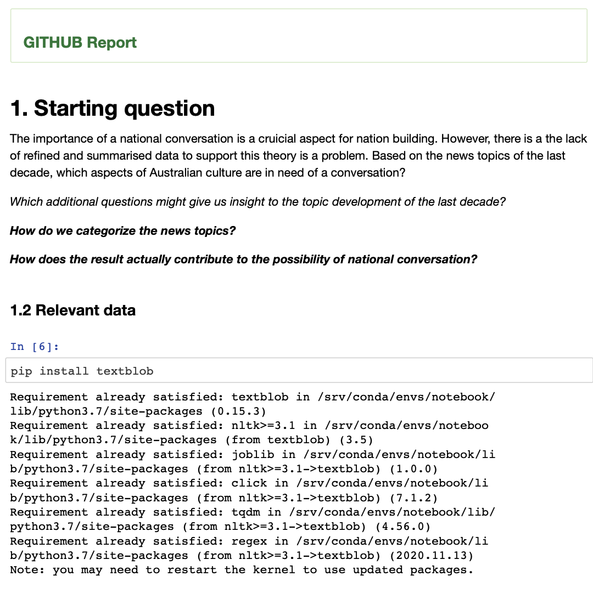

<!-- Data Analytics -->
 

 
  <h3 align="center">Data Analytics Report Overview</h3>
  

    Download the PDF and Word versions here: 
     
    <a href="https://github.com/michaelravina/Data-Analytics-Report/tree/main/Report%20in%20PDF%20%26%20Word%20file"><strong>Explore the docs</strong></a>
     
  

<!-- TABLE OF CONTENTS -->

  
Table of Contents

  <ol>
    <li>
      <a href="#about-the-project">About The Project</a>
      <ul>
        <li><a href="#built-with">Built With</a></li>
      </ul>
    </li>
    <li><a href="#usage">Usage</a></li>
    <li><a href="#contributing">Contributing</a></li>
    <li><a href="#contact">Contact</a></li>
    <li><a href="#acknowledgements">Acknowledgements</a></li>
  </ol>

<!-- ABOUT THE PROJECT -->
## About The Project

Using Jupyter & Python, the report is a culmination of data retrieved from past contributors of the project. Their codes were then modified to fit into two distinct reports within one Jupyter notebook. The topics were: 1) An analysis of Australia's National conversation based on news headlines over the past decades and 2) Mental Health within the IT industry.   

### Built With

This section should list any major frameworks that you built your project using. Leave any add-ons/plugins for the acknowledgements section. Here are a few examples.
* [Jupyter Notebook](https://jupyter.org/try)
* [Python](https://www.python.org/)

<!-- USAGE EXAMPLES -->
## Usage

Snapshots of the report:

1. National conversation is a crucial aspect for nation building. However, there is a lack of data to which topics merit debate. Today, we look into news topics from the past decades and decipher how it possibly contributes to the national convesation. 

2. A bar chart of the amount of news headlines over the past decade.  

3.The final output wherein the names are trimmed together with all the seat & gate numbers, security code, date & time, etc.

<!-- CONTACT -->
## Contact

Your Name - Michael Ravina - michaelravina@yahoo.com

Project Link: [https://github.com/michaelravina/Airplane-ticketing-system]

Linkedin: [linkedin-url]: https://www.linkedin.com/in/mike-ravina-1368a11a8/

<!-- ACKNOWLEDGEMENTS -->
## Acknowledgements
* QUT staff and Dr. Arash for holding my hand (metaphorically) throughout the project
* To the github community for providing me this awesome readme template
