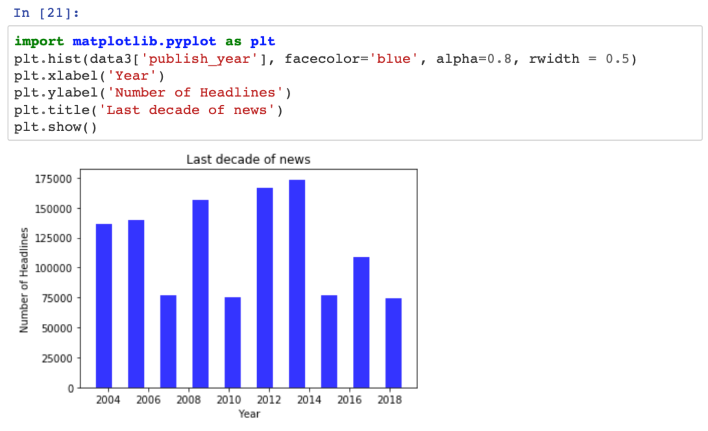
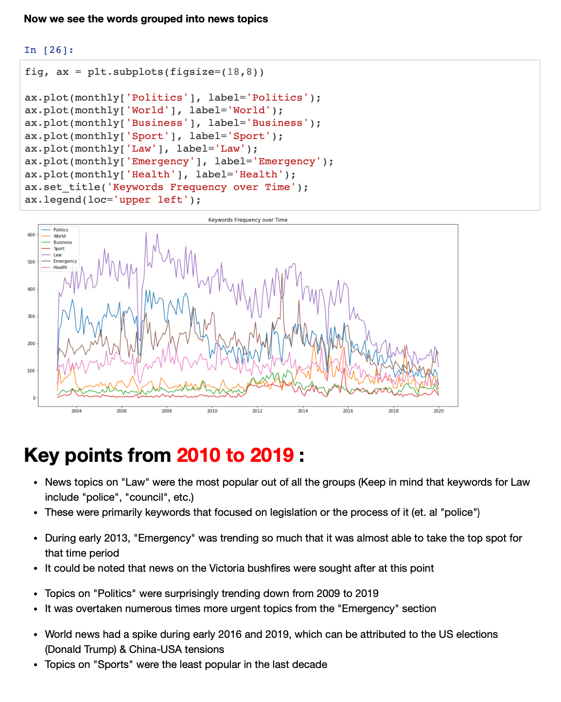
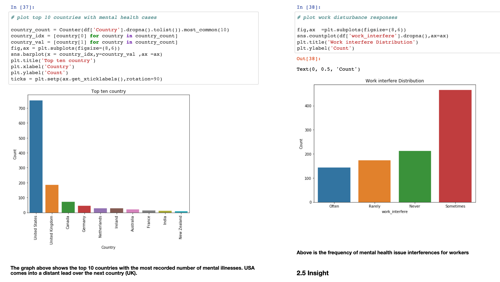
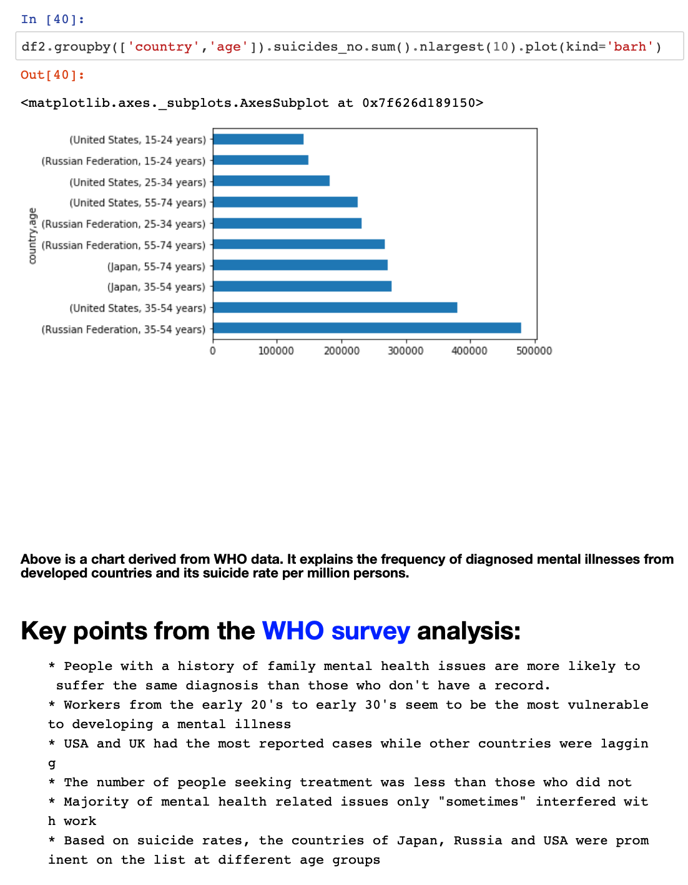
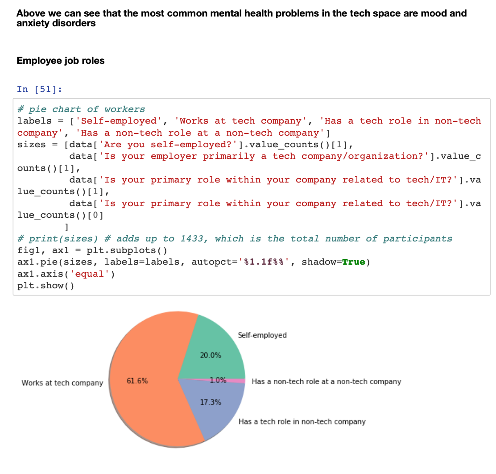
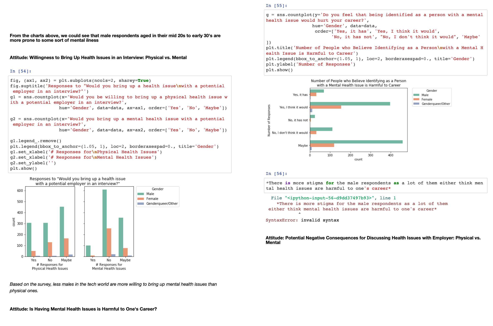
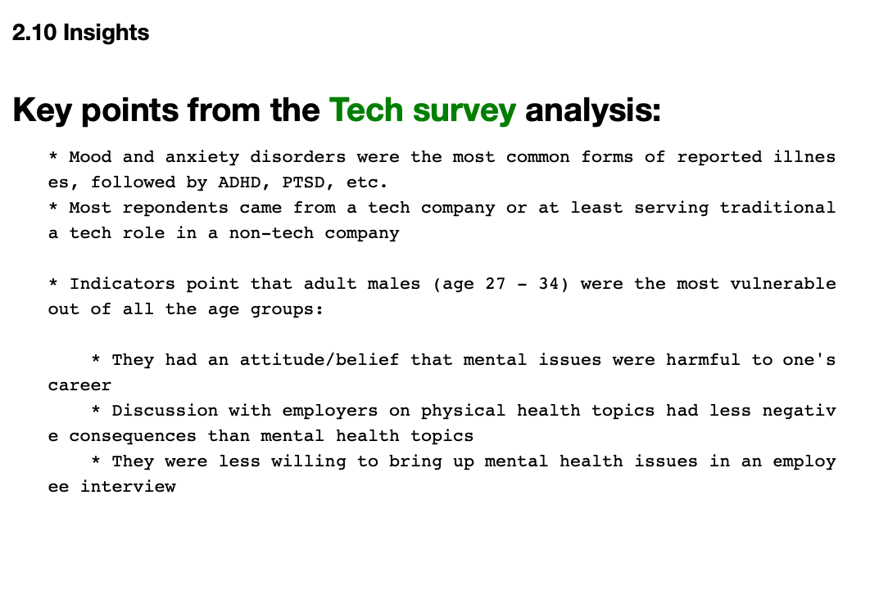

<!-- Data Analytics -->
 

 
  <h3 align="center">Data Analytics Report Overview</h3>
  

    Download the full report here: 
     
    <a href="https://github.com/michaelravina/Data-Analytics-Report/tree/main/Report%20in%20PDF%20%26%20Word%20file"><strong>Explore the docs</strong></a>
     
  

<!-- TABLE OF CONTENTS -->

  
Table of Contents

  <ol>
    <li>
      <a href="#about-the-project">About The Project</a>
      <ul>
        <li><a href="#built-with">Built With</a></li>
      </ul>
    </li>
    <li><a href="#usage">Usage</a></li>
    <li><a href="#contact">Contact</a></li>
    <li><a href="#acknowledgements">Acknowledgements</a></li>
  </ol>

<!-- ABOUT THE PROJECT -->
## About The Project

Using Jupyter & Python, the report is a culmination of modified codes from past contributors of the project. The topics were: 1) An analysis of Australia's National conversation based on news headlines over the past decades and 2) Mental Health based on location/occupation.   

### Built With

This section should list any major frameworks that you built your project using. Leave any add-ons/plugins for the acknowledgements section. Here are a few examples.
* [Jupyter Notebook](https://jupyter.org/try)
* [Python](https://www.python.org/)
* [CSV](https://github.com/michaelravina/Data-Analytics-Report/upload)

<!-- USAGE EXAMPLES -->
## Usage

Snapshots of the report:

 
  <h3 align="center">Report #1: National Conversation Based on News headlines</h3>

1.1 National conversation is a crucial aspect for nation building. However, there is a lack of data to which topics merit debate. Today, we look into news topics from the past decades and decipher how it possibly contributes to the national convesation. 

 

1.2 A bar chart of the amount of news headlines over the past decade.  

 

1.3 After assigning keyword values to the national headline topics using ReGex, we created a linechart to compare the different topics over time. Keypoints were also addressed for the study.

 

 
  <h3 align="center">Report #2: Mental Health illnesses by country and age</h3>

2.1 According to the WHO, mental health is about the state of a person's wellness rather than an illness. There is no official international "guideline" on how to tackle mental health issues and each country addresses its own problems uniquely. We look into the mental health illness distribution by country and age.

 

2.2 From the graph we could see that the USA was leading in terms of mental ilnesses over other industrialized countries. 

 

2.3 After further breakdown the data into frequency based on ages and location, we have come into conclusion that those between the ages of 35-54 are the most vulnerable to mental health issues. 

 

 
  <h3 align="center">Report #3:Mental Health within the IT industry</h3>
  
3.1 What could be the possible predictors of Mental Health issues within the IT industry and the common attitudes towards it?

 

3.2 Pie chart distrubtion of where employees work. 

 

3.3 It was found that males where less likely to bring up mental health issues to their employers. 

 

3.4 Key findings from the report.

<!-- CONTACT -->
## Contact

Your Name - Michael Ravina - michaelravina@yahoo.com

Project Link: [https://github.com/michaelravina/Data-Analytics-Report]

Linkedin: [linkedin-url]: https://www.linkedin.com/in/mike-ravina-1368a11a8/

<!-- ACKNOWLEDGEMENTS -->
## Acknowledgements
* QUT staff and Dr. Catriona for their guidance throughtout the project
* To the past contributors of the project and their dedication
* To the youtube and stack overflow community for their many python tutorials :)
